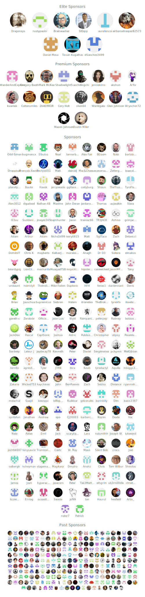

#  TitleCardMaker

An automated title card maker for the Plex, Jellyfin, and Emby media servers. All user documentation is available on the [Wiki](https://github.com/CollinHeist/TitleCardMaker/wiki).

## Support
This has taken a pretty substantial amount of effort, so if you find this project useful you can support me on [BuyMeACoffee](https://www.buymeacoffee.com/CollinHeist), or become a [GitHub sponsor](https://github.com/sponsors/CollinHeist) - I would really appreciate it!

A huge thank you to all my current and past sponsors!

  

